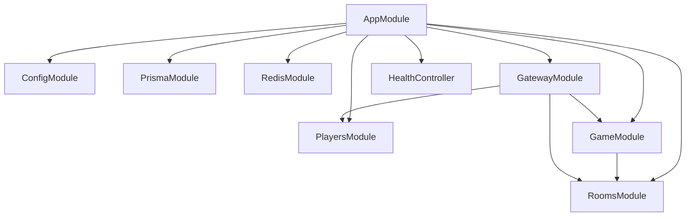
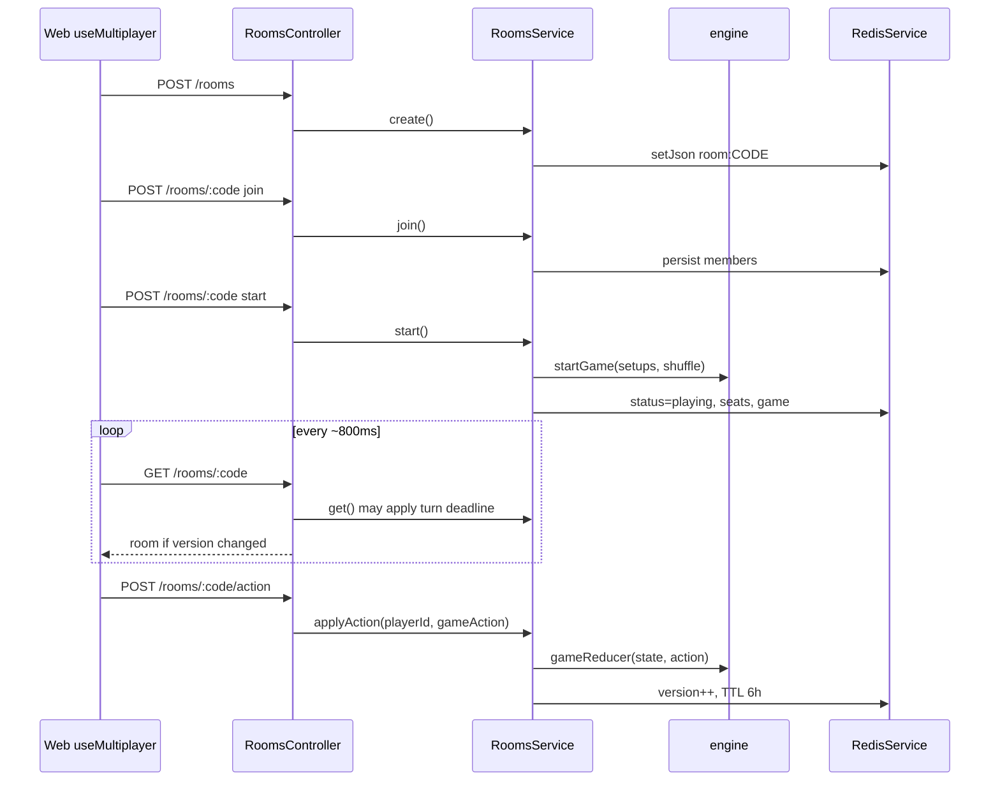
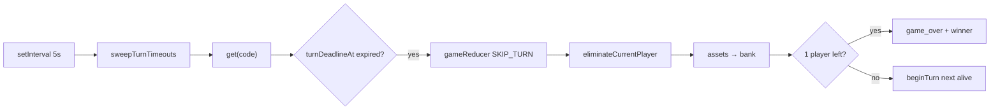

# Robinverse

Multiplayer property-trading game (Monopoly-style) with a NestJS game server and a Next.js client.

The board is themed around real cities by country (India, China, Brazil, Russia, Germany, Australia, UK, USA), driven by `monopoly_board_game.json`.

| Folder | Role |
|--------|------|
| `web/` | Next.js frontend (UI only) |
| `server/` | NestJS backend — rooms, multiplayer, and the full game engine in `server/src/engine/` |
| `docker-compose.yml` | Postgres + Redis (+ Redis Insight) for local infra |

---

## Features

- **Create / join rooms** with a 6-character share code (2–8 players)
- **Classic 40-space board** with city flags, transport (✈), utilities (⚡/💧), Fortune / Treasury, and tax tiles
- **Live board center** — 3D dice, whose turn it is, fading activity log
- **Buy, rent, auction, jail, cards, mortgage, houses/hotels, trade**
- **Ownership washes** — owned tiles tint with the owner’s color
- **3-minute turn timer** — if a player goes AFK, they are **eliminated** (bankrupt); remaining players continue, or the last player wins
- **Landing page** at `/` · play lobby at `/play`
- **Swagger** at `http://localhost:4000/api/docs`
- **Socket.IO** namespace `/game` (available; the web client currently uses REST + ~800ms polling)

---

## Prerequisites

- Node.js 20+ (recommended)
- [pnpm](https://pnpm.io/) (or npm)
- Docker (optional, for Postgres/Redis)

---

## Quick start

### 1. Infra (optional but recommended)

```bash
docker compose up -d
```

Starts:

| Service | Port |
|---------|------|
| Postgres | `5432` |
| Redis | `6379` |
| Redis Insight | `5540` |

For a zero-infra local run, keep `REDIS_MODE=memory` in `server/.env` (default in `.env.example`). Postgres is only required if you use Prisma-backed player persistence.

### 2. Server

```bash
cd server
cp .env.example .env   # if you don’t already have .env
pnpm install
pnpm prisma:generate   # if using Postgres
pnpm start:dev
```

- API: [http://localhost:4000](http://localhost:4000)
- Health: [http://localhost:4000/api/health](http://localhost:4000/api/health)
- Swagger: [http://localhost:4000/api/docs](http://localhost:4000/api/docs)

### 3. Web

```bash
cd web
pnpm install
pnpm dev
```

- App: [http://localhost:3000](http://localhost:3000)

The web app proxies `/api/*` → `http://localhost:4000/api/*` (see `web/next.config.ts`).  
Default client base URL is `/api` (`NEXT_PUBLIC_API_URL`). Override the proxy target with `API_PROXY_TARGET` if the server is not on port 4000.

---

## Environment

### `server/.env`

| Variable | Default | Purpose |
|----------|---------|---------|
| `PORT` | `4000` | HTTP port |
| `CORS_ORIGIN` | `http://localhost:3000` | Allowed origins (comma-separated) |
| `DATABASE_URL` | Postgres URL | Prisma / players |
| `REDIS_URL` | `redis://localhost:6379` | Room state store |
| `REDIS_MODE` | `memory` | `memory` = in-process Map; `redis` = ioredis |

Copy from `server/.env.example`.

### `web` (optional)

| Variable | Default | Purpose |
|----------|---------|---------|
| `NEXT_PUBLIC_API_URL` | `/api` | Client API prefix |
| `API_PROXY_TARGET` | `http://localhost:4000` | Next.js rewrite destination |

---

## Project layout

```
Robinverse/
├── docker-compose.yml
├── monopoly_board_game.json          # board dataset (source)
├── server/
│   ├── src/
│   │   ├── engine/                   # rules, board load, reducer
│   │   ├── rooms/                    # create / join / actions / turn timeout
│   │   ├── game/                     # thin game service over rooms
│   │   ├── gateway/                  # Socket.IO /game
│   │   ├── players/                  # guest profiles (Prisma)
│   │   ├── redis/                    # Redis + memory fallback
│   │   └── data/monopoly_board_game.json
│   └── prisma/
└── web/
    ├── src/
    │   ├── app/                      # routes: / , /play
    │   ├── components/monopoly/      # Board, lobby, dice, panels
    │   ├── hooks/useMultiplayer.ts   # REST + polling
    │   └── lib/monopoly/             # types + action payloads (no server rules)
    └── public/                       # flags, dice art, board JSON copy
```

**Source of truth for rules:** `server/src/engine/`. The web client sends `GameAction` payloads; it does not run the engine.

---

## Backend architecture

The NestJS server is the **authority** for rooms and Monopoly rules. The web UI is a thin client: it posts actions and polls room state. Live game state is **not** stored in Postgres — it lives in Redis (or an in-memory Map).

### Mental model

```
Browser (Next.js)
   │  REST /api/rooms/*  (+ ~800ms poll)
   ▼
RoomsController ──► RoomsService ──► gameReducer (engine)
                          │
                          ▼
                   RedisService
                   (redis | memory)
```

Socket.IO (`/game`) and Prisma exist as optional layers. The current web client uses **HTTP only**.

### Module wiring



| Module | Responsibility |
|--------|----------------|
| `ConfigModule` | Env: `PORT`, `CORS_ORIGIN`, `REDIS_*`, `DATABASE_URL` |
| `RoomsModule` | Lobby lifecycle, actions, seat map, AFK sweep |
| `engine/` (imported by rooms) | Board + `startGame` / `gameReducer` — all rules |
| `GameModule` | Thin helpers (`next`, `buy`, …) used mainly by the gateway |
| `GatewayModule` | Socket.IO namespace `/game` (parallel API; unused by web today) |
| `RedisModule` | KV: rooms, optional player/socket maps |
| `PlayersModule` | Guest profiles (Prisma if up, else Redis) |
| `PrismaModule` | Optional Postgres; soft-fails if DB is down |
| `HealthController` | `GET /api/health` |

Bootstrap (`main.ts`): global prefix `api`, CORS, Swagger at `/api/docs`, port `4000`.

### Request lifecycle (create → play)



1. **Create** — host gets a 6-char code; room `status = lobby`.
2. **Join / ready** — members added; colors assigned from defaults if needed.
3. **Start** (host) — builds `PlayerSetup[]`, calls `startGame`, maps `playerId → seat` (`1..n`; seat `0` is unused/bank).
4. **Poll** — clients compare `room.version`; UI updates only on change.
5. **Action** — only the seated current player may take turn-scoped actions (`NEXT`, `BUY`, build, jail, resign, …). State is cloned inside `gameReducer`, then saved.

Mutations for a room are **serialized** with a per-code promise chain (`enqueue`) to avoid overlapping writes.

### Game engine

```
monopoly_board_game.json
        ↓
server/src/data/…  (and board.ts loaders)
        ↓
engine/board.ts     → tiles, rents, Fortune/Treasury, GAME_META
        ↓
engine/engine.ts    → startGame / beginTurn / gameReducer
        ↓
RoomsService.start / applyAction
```

| Piece | Role |
|-------|------|
| `startGame(setups)` | Build board, shuffle order, starting cash, first `beginTurn()` |
| `beginTurn()` | Advance to next alive player; set `turnDeadlineAt = now + 3m` |
| `gameReducer(prev, action)` | Pure-ish state transition for all Monopoly actions |
| `SKIP_TURN` | System timeout path → eliminate current player |

The web’s `web/src/lib/monopoly/` holds **types and action shapes only**. Multiplayer outcomes always come from the server engine.

### Storage: Redis vs memory

| `REDIS_MODE` | Behavior |
|--------------|----------|
| `memory` (default) | In-process `Map` — fine for single-server local dev |
| `redis` | `ioredis` via `REDIS_URL`; falls back to memory if connect fails |

**Keys**

| Key | Contents |
|-----|----------|
| `room:{CODE}` | Full `RoomState` JSON (lobby + `game` + `seats` + `version`) |
| `player:{id}` | Guest profile cache (optional) |
| `socket:{id}` / `socket-room:{id}` | Gateway disconnect / room leave maps |

Room JSON TTL ≈ **6 hours**. Postgres/`prisma` Room & Game models exist in the schema for later match history — **not wired into `RoomsService` yet**.

### REST vs Socket.IO

| Transport | Used by web? | Role |
|-----------|--------------|------|
| **REST** `/api/rooms/*` | **Yes** | Create, join, start, action, poll |
| **Socket.IO** `/game` | No (not wired in client) | Same room/game services; push `ROOM_UPDATED` / game events |

Prefer REST+polling for the current MVP; gateway is ready when the client switches to realtime.

### Turn timeout / AFK elimination



- Deadline set on each `beginTurn` (`TURN_LIMIT_MS = 3 minutes`).
- Enforced on **every** `GET /rooms/:code`, `applyAction`, and a **5s background sweep** over active playing rooms.
- Timeout **eliminates** the player (not a soft pass): `position = -1`, money non-finite, properties to bank.
- Auctions are excluded from AFK elimination checks (`isTurnExpired` skips `auction` phase).

### Players / Prisma

- Core multiplayer **does not require** Postgres.
- Web generates `playerId` in `localStorage` and sends it on every request (no session cookie yet).
- `POST /players/guest` upserts a User when Prisma is available; otherwise Redis-only profile (used more by the gateway path).

### Server folder map

| Path | Role |
|------|------|
| `src/main.ts` | Bootstrap, CORS, Swagger |
| `src/app.module.ts` | Module graph |
| `src/rooms/` | HTTP + room state machine + AFK |
| `src/engine/` | Rules, board, reducer, turn limit |
| `src/data/monopoly_board_game.json` | Board dataset |
| `src/game/` | Thin façade for gateway actions |
| `src/gateway/` | Socket.IO `/game` |
| `src/redis/` | Redis + memory KV |
| `src/players/` | Guest identity |
| `src/prisma/` | Optional DB client |
| `src/common/events.ts` | Socket event name constants |

More detail also lives in [`server/README.md`](server/README.md).

---

## How multiplayer works (player view)

1. Host creates a room → receives a code  
2. Others join with the code  
3. Host starts → seats map to engine players (order can shuffle)  
4. Clients poll `GET /api/rooms/:code` (~800ms) and post actions to `POST /api/rooms/:code/action`  
5. Server applies actions through `gameReducer`, enforces turn ownership, and persists room state (Redis or memory)

### Turn timer (3 minutes)

- Each turn gets `turnDeadlineAt = now + 3 minutes`
- Countdown is shown in the board center
- On expiry the current player is **eliminated** (bankrupt; assets return to the bank)
- If one player remains → they win  
- If two or more remain → the game continues without the AFK player

---

## HTTP API (summary)

Base path: `/api`

| Method | Path | Description |
|--------|------|-------------|
| `GET` | `/health` | Health check |
| `POST` | `/rooms` | Create room |
| `GET` | `/rooms/:code` | Get room (also enforces turn timeout) |
| `POST` | `/rooms/:code/join` | Join lobby |
| `POST` | `/rooms/:code` | Lobby actions: `join` \| `leave` \| `start` \| `ready` |
| `POST` | `/rooms/:code/action` | Body: `{ playerId, gameAction }` |
| `POST` | `/players/guest` | Ensure guest profile |
| `GET` | `/players/:id` | Get player |

Full interactive docs: [Swagger UI](http://localhost:4000/api/docs).

### Example game actions

```json
{ "type": "NEXT" }
{ "type": "BUY" }
{ "type": "DECLINE_BUY" }
{ "type": "BUY_HOUSE", "index": 1 }
{ "type": "SELL_HOUSE", "index": 1 }
{ "type": "RESIGN" }
{ "type": "SKIP_TURN" }
```

`SKIP_TURN` is applied by the server on timeout (system). Clients normally use `NEXT` (roll or end turn), buy/build/trade actions, etc.

---

## Gameplay notes

- Starting cash, GO salary, jail fine, house/hotel pools come from the board JSON meta
- Color sets must be complete to build; even building rules apply; hotels need bank houses when selling down
- Unowned properties you land on enter an auction queue if not bought
- Fortune / Treasury decks, jail, mortgages, and trades are handled in the engine

---

## Scripts

### Server (`cd server`)

| Script | Description |
|--------|-------------|
| `pnpm start:dev` | Nest watch mode |
| `pnpm build` / `pnpm start:prod` | Production build & run |
| `pnpm prisma:generate` | Generate Prisma client |
| `pnpm prisma:migrate` | Dev migrations |
| `pnpm prisma:studio` | Prisma Studio |

### Web (`cd web`)

| Script | Description |
|--------|-------------|
| `pnpm dev` | Next.js dev server |
| `pnpm build` / `pnpm start` | Production |
| `pnpm lint` | ESLint |

---

## Development tips

- Prefer `REDIS_MODE=memory` for the fastest local loop; switch to `redis` when testing multi-instance / persistence
- After changing `monopoly_board_game.json`, keep `server/src/data/` (and `web/public/` if mirrored) in sync
- Board UI and log live in `web/src/components/monopoly/Board.tsx`; styles in `web/src/app/globals.css`

---

## Known gaps / roadmap

- Web client still trusts client-supplied `playerId` (no auth session yet)
- Mid-game leave / reconnect polish
- Prefer Socket.IO on the web for lower latency instead of polling
- Redis write races under heavy concurrent actions

---

## License

Private / unlicensed unless otherwise stated.
